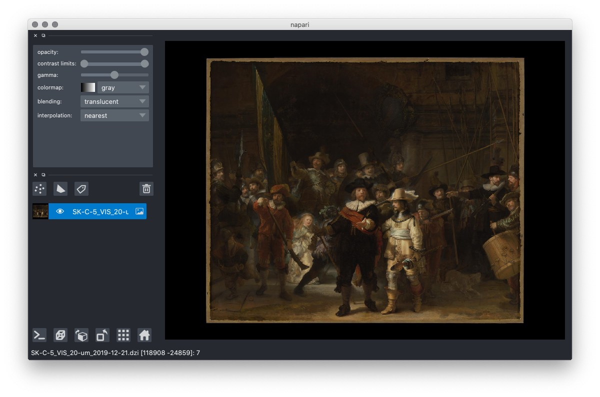

# napari-dzi-zarr

An experimental plugin for viewing Deep Zoom Images (DZI) with napari + zarr + dask.

----------------------------------

This [napari] plugin was generated with [Cookiecutter] using with [@napari]'s [cookiecutter-napari-plugin] template.

## Description 

The [DZI File Format](https://github.com/openseadragon/openseadragon/wiki/The-DZI-File-Format) 
is a pyramidal tile source specification where individual tiles are RGB/RGBA JPEG/PNG images. 
DZI is a very popular tile source for zoomable web-viewers like 
[OpenSeadragon](https://openseadragon.github.io/), and as a result many tile sources are available over 
HTTP. This plugin wraps a DZI tile source (local or remote) as a multiscale Zarr, where each pyramidal level is a `zarr.Array` of shape `(level_height, level_width, 3/4)`, allowing the same images to be viewed 
in `napari` + `dask`.

## Installation

You can install `napari-dzi-zarr` via [pip]:

    pip install napari-dzi-zarr

## Usage

This high-resolution scan of Rembrandt's Night Watch is available thanks to [R.G Erdmann](https://twitter.com/erdmann). More examples can be found on [boschproject.org](http://boschproject.org).

    $ napari http://hyper-resolution.org/dzi/Rijksmuseum/SK-C-5/SK-C-5_VIS_20-um_2019-12-21.dzi

## Contributing

Contributions are very welcome. Tests can be run with [tox].

## License

Distributed under the terms of the [BSD-3] license,
"napari-dzi-zarr" is free and open source software

## Issues

If you encounter any problems, please [file an issue] along with a detailed description.

[napari]: https://github.com/napari/napari
[Cookiecutter]: https://github.com/audreyr/cookiecutter
[@napari]: https://github.com/napari
[MIT]: http://opensource.org/licenses/MIT
[BSD-3]: http://opensource.org/licenses/BSD-3-Clause
[GNU GPL v3.0]: http://www.gnu.org/licenses/gpl-3.0.txt
[GNU LGPL v3.0]: http://www.gnu.org/licenses/lgpl-3.0.txt
[Apache Software License 2.0]: http://www.apache.org/licenses/LICENSE-2.0
[Mozilla Public License 2.0]: https://www.mozilla.org/media/MPL/2.0/index.txt
[cookiecutter-napari-plugin]: https://github.com/napari/cookiecutter-napari-plugin
[file an issue]: https://github.com/manzt/napari-dzi-zarr/issues
[napari]: https://github.com/napari/napari
[tox]: https://tox.readthedocs.io/en/latest/
[pip]: https://pypi.org/project/pip/
[PyPI]: https://pypi.org/
